# Borealis Atlas

**This starts with [Borealis](https://github.com/marko-builds/borealis), by
Marko Stankovic.** It is a beautiful piece of work — a summoned fullscreen
aurora, entirely procedural, one fragment shader and not a single image asset,
with a colour sense that is the whole reason any of this looks the way it does.
We loved it, installed it, and then kept wanting to ask it questions: what is
the weather doing, when does the sun actually rise here, what does the horizon
look like where I am.

Borealis Atlas is what came of asking. It is a touchscreen sky and weather
explorer built on his aurora: today's real forecast, the sun rising and setting
when it really does, the horizon measured from the terrain around you, snow
lying above the freezing level, and the aurora at whatever the solar wind is
doing tonight. Look at somewhere else and you get its clock too — Istanbul at
its own hour, not yours. Drag a finger across the screen and time moves — seven
days back, sixteen forward.

Still 100% procedural. Still one fragment shader, still no image assets. That
was his idea and it is worth keeping.

The one binary here is the compiled shader, and you do not have to trust it:
the build is deterministic and reproducible in one command — see
[build provenance](docs/build-provenance.md).

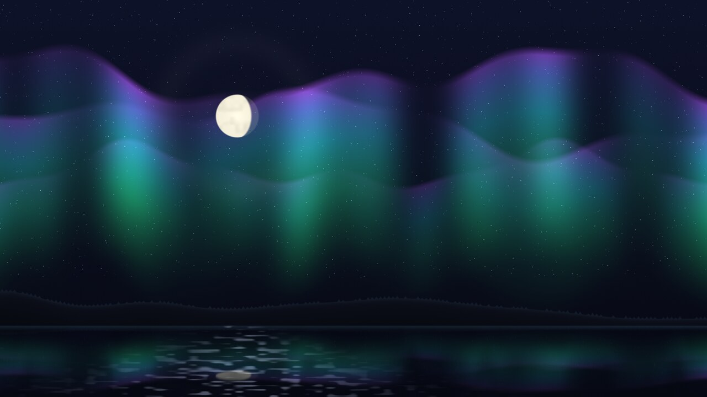

> **The aurora is his.** `curtain()`, `ramp()`, `vnoise()`, `hash21()`,
> `dither()` and `meteors()` are unchanged from Borealis, and all five palettes
> are his colours to the last digit. See [Credits](#credits) — it is worth
> reading before you assume any of the prettiness here is ours.

## What it looks like

Every image below is a real render at a real moment — a place, a date and an
hour that the data actually had. Nothing is staged; where there is fog it is
because there was fog.

### One place, through a day

Montreal, at its own true sunrise and sunset for that date.

| | |
|---|---|
| 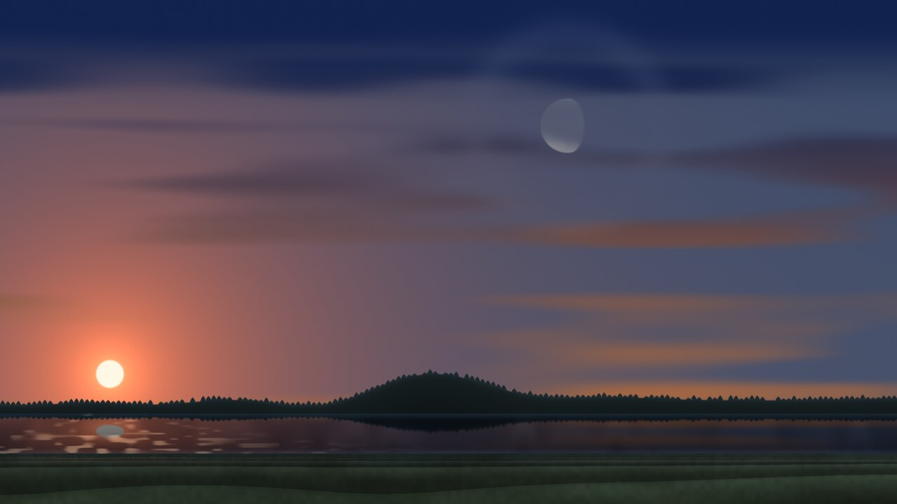 | 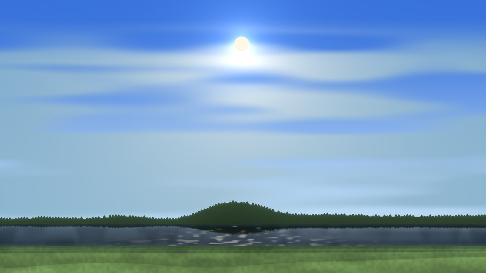 |
| **06:16 — sunrise.** Not six o'clock: the sun clears the horizon when it really does, and the moon is still up. | **Midday.** The far bank, Mount Royal on the skyline, and the near bank you are standing on. |
| 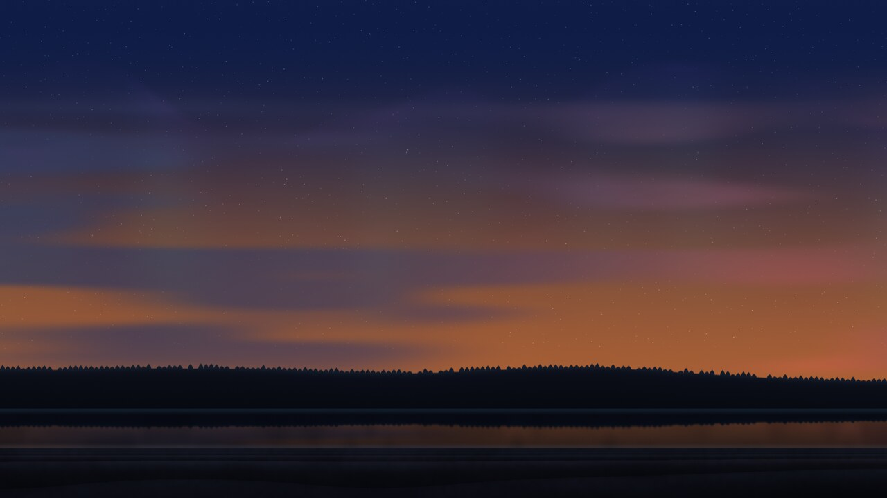 | 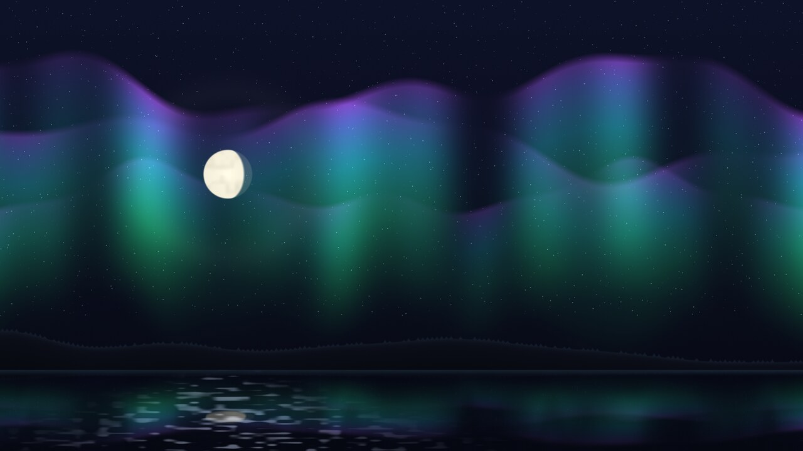 |
| **19:32 — sunset.** The day length comes from the date and the latitude, so this moves through the year. | **Night**, here at Reykjavik, with the aurora at whatever NOAA says the solar wind is doing. |

### Weather it found, not weather it invented

| | |
|---|---|
| 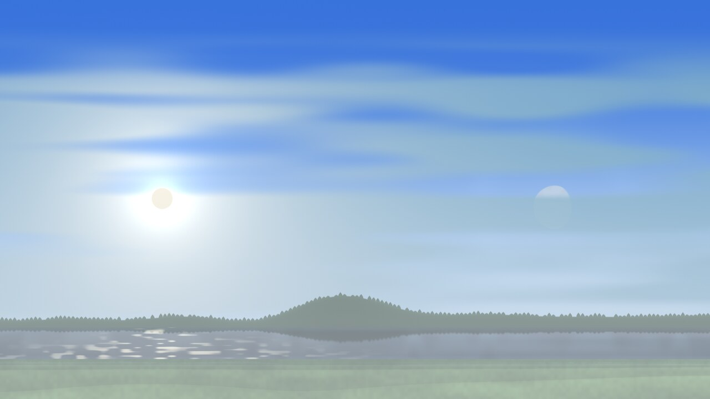 | 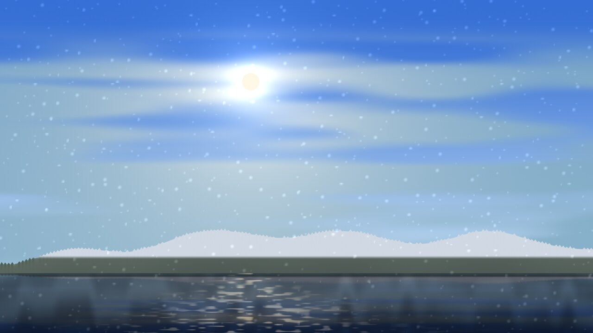 |
| **Fog** — Montreal, 31 August, 08:00. The forecast said fog for that hour, so the scene is fogged. | **Snow** — Ushuaia, 12 September. Snow showers at 4.8 °C over 7 cm of lying snow, which is why the ground is white and the air is not clear. |

A thunderstorm is read from the state of the atmosphere rather than from the
weather code, because the codes disagree and the physics does not. On the
Toronto storm of 2 September the four global models called that hour violent
showers, showers, thunderstorm and drizzle — and all four put CAPE between 1770
and 2690 J/kg, which is a severe-thunderstorm atmosphere whatever it is
labelled. Past the tier the weather services
use for a severe thunderstorm warning, the deck drops and goes green-black, the
rain turns into a curtain and the lightning gets a channel you can see.

### Places that look like themselves

| | |
|---|---|
| 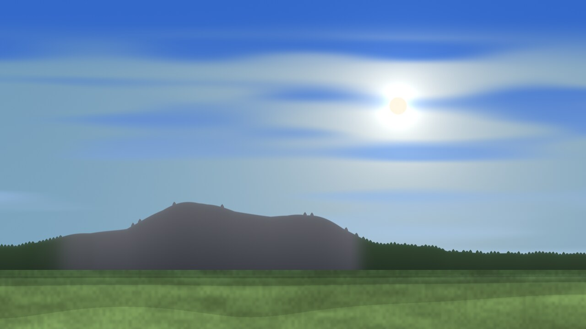 | 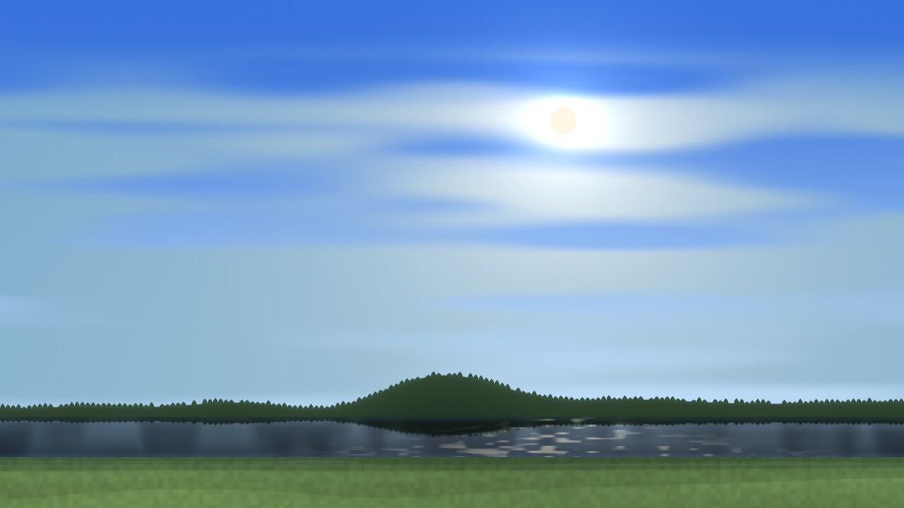 |
| **Quito.** Pichincha where it really stands, bare above the treeline, paramo in front and no lake — because there is no water within 6 km of Quito. | **Montreal.** Seen from across the St Lawrence, because that is where the water is. The swell on the skyline is Mount Royal. |
| 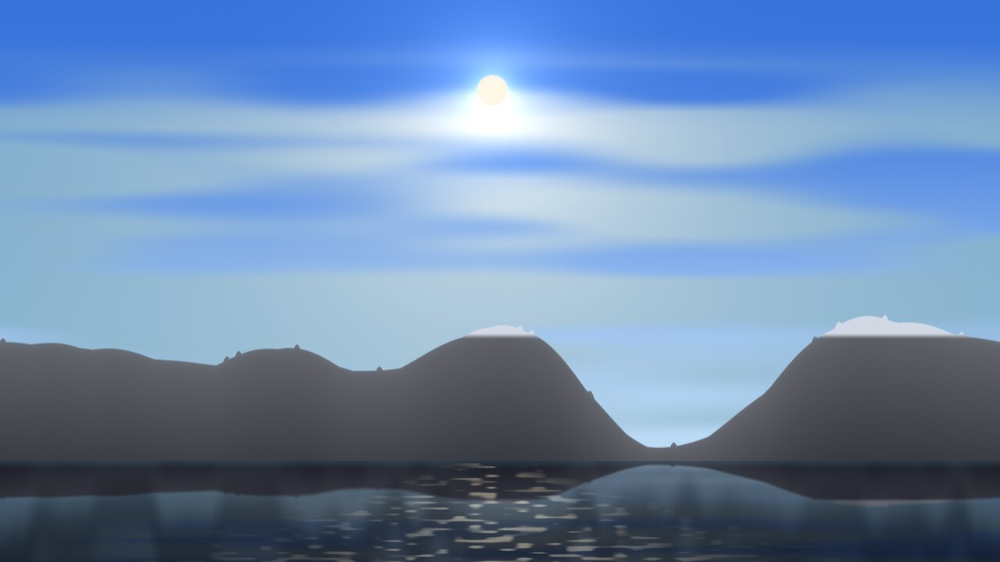 | 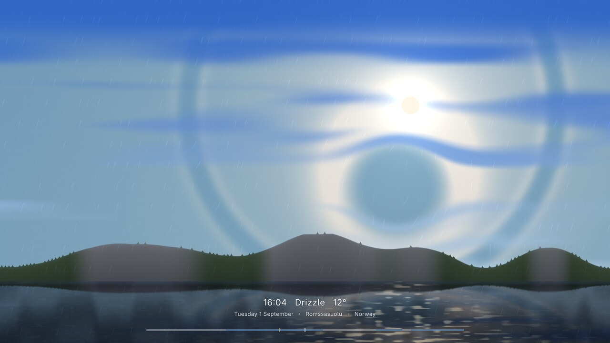 |
| **Zermatt.** Snow lies above the freezing level and nowhere else, so the line cuts dead straight across the range, and it moves as you scrub through colder days. | **Tromso.** The treeline is about 700 m this far north, so the fjord ridges are forested at the bottom and bare above it. |

### The moon, at its real phase

Same overlay, three different dates. The phase is arithmetic, not a picture.

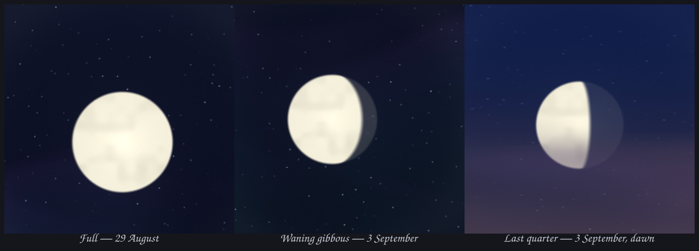

The sun and the moon are drawn the same size, because in a real sky they are:
both are almost exactly half a degree wide, and that coincidence is the only
reason an eclipse is a thing that can happen at all. So it happens here. The
moon's position comes from the same series as its phase, including the tilt of
its orbit — which is why an eclipse is rare rather than monthly — and its
distance decides whether you get a corona or a ring of sun left showing.
Checked against every solar and lunar eclipse from 2026 to 2028: each one lands
on the right day, with the right kind, and the new moons in between pass by
without incident.

### Five palettes, all of them his

Every colour below was chosen by Marko Stankovic for Borealis and is carried
here unchanged — the six-stop ramps and the sky tints, digit for digit.
`aurora` by default; `ember`, `gold`, `nord` and `ice` are one key in
`shell.json`, or a two-finger tap. Same place, same minute.

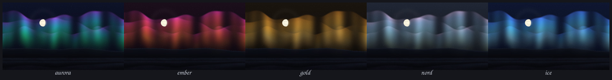

## Install

```sh
omarchy plugin add https://github.com/rma131/omarchy-borealis-atlas.git --enable
```

Then bind it. Omarchy's Hyprland config is Lua, so in
`~/.config/hypr/bindings.lua`:

```lua
o.bind("SUPER + ALT + B", "Borealis Atlas",
       "omarchy-shell shell summon io.github.rma131.borealis-atlas")
```

## Remove

```sh
omarchy plugin remove io.github.rma131.borealis-atlas
```

That takes the plugin and its `shell.json` entry with it. One file is left
behind, the cached sky at `~/.local/state/omarchy/borealis-sky.json`; delete it
if you want nothing left:

```sh
rm -f ~/.local/state/omarchy/borealis-sky.json
```

## Requirements

- **Omarchy 4 (Quattro)** or later — it is a Quickshell `overlay` plugin
- **`curl`** — the only runtime dependency beyond a POSIX shell
- A **touchscreen** is the point of it, but every gesture has a pointer
  equivalent and it is perfectly usable with a mouse

Built and measured on one machine: a ThinkPad X1 Yoga 3rd Gen with Intel UHD 620
graphics, 1920×1080. It has not been tried on anything else. It is a fullscreen
shader and it is not cheap — see [docs/measurements.md](docs/measurements.md)
before you leave it running on battery.

## Use

**`SUPER + ALT + B`** summons it, once you have bound it as above. It is an
overlay, so it sits over whatever you were doing and gets out of the way again
on any key or a quick tap.

| Gesture | What happens |
|---|---|
| Drag left or right | Move through time — 7 days back, 16 forward |
| Double tap | Return to now, rolling back through the days |
| Quick tap | Dismiss |
| Two-finger tap | Next palette |
| Press and hold, or drag | Play with the aurora — no dismiss |
| `/` | Go to a place, a moment, or both |
| Any other key | Dismiss |

### `/` — a place, a moment, or both

```
Istanbul                  the place, at its own local hour
Istanbul @ tomorrow 15:00 both
Quito, 12 Sep             a comma works as well as an @
sunset                    a moment here, without moving
+3        yesterday 15:00        2026-09-12 6:30        friday 3pm
```

Either half alone is fine. With no separator the line is taken as a moment only
if it plainly is one — it has a digit in it, or it is a word like `tomorrow` —
so `March`, `Sunday` and `New York` still look for towns. Empty Enter follows
this machine again.

A moment you asked for holds the sky still, because a date you typed is a
question and not ambience; touching the screen hands it back to the clock.

**The clock is the place's, not yours.** Go to Istanbul from Montreal and you
get Istanbul's afternoon, not your morning — the forecast was always in local
hours, and now the sun is too. The readout names the zone whenever it differs
from your own.

Up to three fingers at once. A finger is a repulsor in the aurora rather than a
light drawn on top of it: the curtains are sampled *through* the field, so light
thins where it is rarefied and burns where it piles up, and springs back when
you let go.

A readout under the scene names the date, the conditions and the temperature at
wherever you have dragged to, and a strip along the bottom shows the whole
window at a glance.

## Configure

Everything lives on the plugin's own entry in `~/.config/omarchy/shell.json`,
and is applied live when you save:

```json
{
  "plugins": [
    {
      "id": "io.github.rma131.borealis-atlas",
      "location": "Reykjavik",
      "palette": "ember",
      "auroraFloor": 0.12
    }
  ]
}
```

| Key | Default | Meaning |
|---|---|---|
| `location` | — | A place name. Geocoded once and remembered. |
| `latitude` / `longitude` | — | Exact coordinates, taking precedence over `location`. |
| `palette` | `aurora` | `aurora`, `ember`, `gold`, `nord`, `ice`. |
| `auroraFloor` | `0.12` | Keeps a ghost of aurora on a quiet night, so the scene stays itself. |

With **no** location set it follows your IP, so a VPN moves the sky with you.
A two-finger tap also cycles the palette for the life of the shell, and that
override is deliberately *not* written back to `shell.json` — your configured
palette is never silently rewritten.

## What it fetches, and where that goes

No account, no API key, nothing stored anywhere but your own machine.

| What leaves your machine | Where it goes | Why |
|---|---|---|
| Your IP, implicitly | `get.geojs.io`, and `wttr.in` as a fallback | To know roughly where you are — **only when no location is configured** |
| An approximate latitude and longitude | `api.open-meteo.com`, `archive-api.open-meteo.com`, `geocoding-api.open-meteo.com` | Forecast, a year of climate normals, terrain elevation, and place search |
| Nothing | `services.swpc.noaa.gov` | NOAA's global aurora index, which is the same for everyone |

Set `location` in `shell.json` and the IP lookup never happens at all.

It writes exactly one file, `~/.local/state/omarchy/borealis-sky.json`, holding
the last answers so the overlay opens instantly and still works offline. It
never edits `shell.json` or any other configuration.

**None of those services is treated as trusted.** A TLS-valid endpoint, or an
intermediary that terminates TLS, is not a trustworthy source of length or
shape, so every reply is bounded twice — `curl` aborts the transfer once a
per-endpoint byte cap is passed, and the collected text is checked again before
it can reach `JSON.parse`. Arrays must be within a known cardinality and the
same length as the axis they are indexed by, numbers must be finite and in
range, and strings are capped where they enter. Every `Text` in the overlay is
`Text.PlainText`, without exception, so nothing an API returns can be
interpreted as markup.

The cache is written the careful way: the payload goes over stdin rather than
argv (`/proc/*/cmdline` is world-readable), into a 0700 directory as a 0600
file, refusing a symlinked or non-regular destination, via a same-directory
temporary that is flushed and then atomically renamed. It is read back as
untrusted input — bounded, shape-checked, and discarded rather than trusted if
either fails.

Weather, climate, elevation and geocoding come from
[Open-Meteo](https://open-meteo.com) (CC BY 4.0), built on
[ECMWF](https://www.ecmwf.int) and other national services; elevation is the
[Copernicus DEM](https://spacedata.copernicus.eu). Space weather is
[NOAA SWPC](https://www.swpc.noaa.gov), public domain.

## How it works

The interesting parts are all in [docs/design.md](docs/design.md) — how the
horizon is measured rather than invented, how snow finds the freezing level, how
water is detected by being the one flat thing in a terrain model, and what was
tried and thrown away. [docs/development.md](docs/development.md) covers
rebuilding the shader and clearing the QML cache, and
[docs/build-provenance.md](docs/build-provenance.md) shows how to verify the
one compiled artifact in this repository against its source.

## Credits

### Borealis, by Marko Stankovic

[github.com/marko-builds/borealis](https://github.com/marko-builds/borealis) —
MIT. This is not a project that was merely *inspired* by Borealis. It is built
on it, and most of what makes it beautiful is still his work, unchanged.

Measured against his source rather than asserted from memory:

| | his | kept here verbatim |
|---|---|---|
| `Borealis.qml` substantive lines | 92 | **87** |
| `aurora.frag` substantive lines | 171 | **118** |

Specifically and entirely his:

- **The aurora itself.** `curtain()` — the function that draws the curtains —
  is byte-for-byte his, as are `ramp()` (the six-stop colour interpolation),
  `hash21()`, `dither()`, `vnoise()` and `meteors()`. Six functions, not one
  character changed.
- **All five palettes.** `aurora`, `ember`, `gold`, `nord`, `ice` — the stop
  positions, the six RGB triplets each, and the sky base and amplitude tints,
  identical to his. He ported them from his own generative aurora engine. Every
  colour in every screenshot in this README is his choice, including the
  palette comparison strip above, which is a showcase of his work and not ours.
- **The shape of the scene.** Curtains over a starfield, meteors, a crescent
  moon, a forested ridge standing on water that mirrors the sky. The
  composition, the layering order, and the decision to reflect the upper scene
  through a stretched mirror are all his.
- **The architecture.** One `qsb`-compiled fragment shader, zero assets, the
  palette passed as six `vec4` uniforms rather than a const array, a layer-shell
  overlay that is deliberately modal. We inherited all of it and it has held up
  under roughly four times the amount of code.

What is added here: a finger the light reacts to, real weather and a real sun,
a horizon measured from elevation data, water found rather than assumed, snow
above the freezing level, and a 23-day scrub. It is a lot of work, and it is
all *around* his aurora rather than instead of it.

**If you want the original** — calm, non-interactive, and lovely exactly as it
is — install that one instead:

```sh
omarchy plugin add https://github.com/marko-builds/borealis.git --enable
```

## Licence

MIT — see [LICENSE](LICENSE). Copyright is held jointly: Marko Stankovic for
the original Borealis, and rma131 for everything added here.
